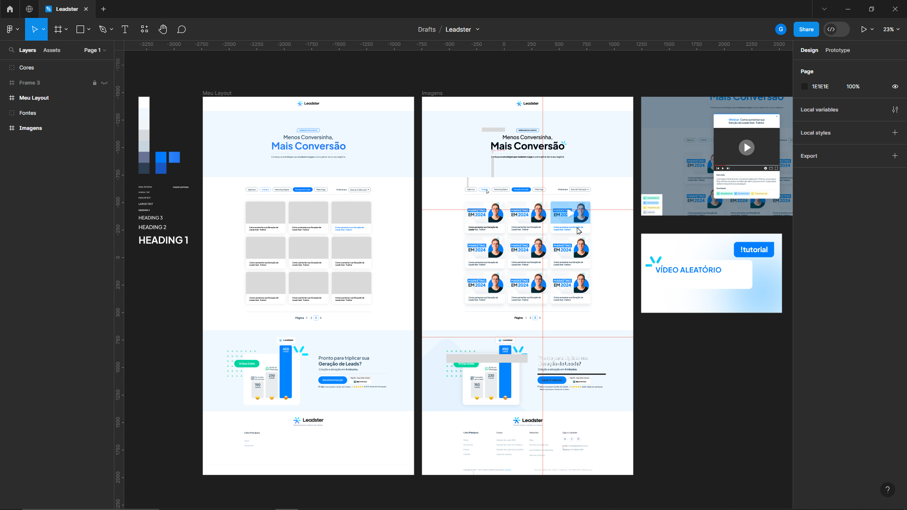
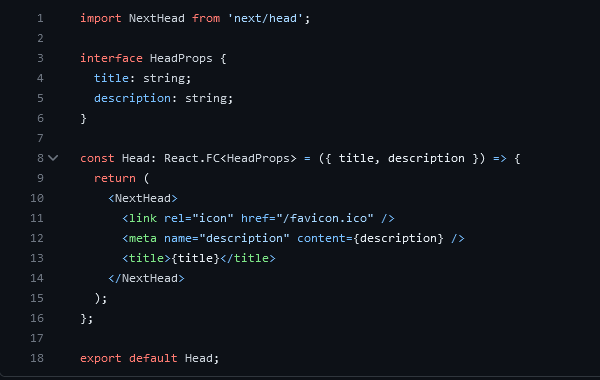
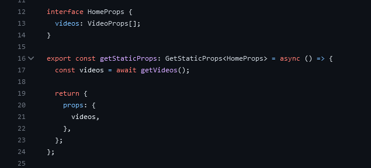

# Desafio Front-End Leadster

Minha resolução do desafio da líder em Marketing Conversacional no Brasil (pros íntimos, [Leadster](https://leadster.com.br/) ☺️). Feito com Next.Js e Styled Components. ~~Em andamento. Previsão de término: 12/07/2023 (7 dias).~~ Concluído em 12/07/2023

## Pré-requisitos

Antes de começar, você vai precisar ter instalado as seguintes ferramentas:

- [Node.js](https://nodejs.org/en/)
- [Git](https://git-scm.com)

## 🚀 Como instalar

### Clone este repositório

```bash
git clone https://github.com/guidiasz/desafio-front-end-leadster.git
```

### Acesse a pasta do projeto no terminal

```bash
cd desafio-front-end-leadster
```

### Instale as dependências

```bash
npm install
```

### Inicie o servidor

```bash
 npm run dev
```

Agora basta abrir o link `http://localhost:3000` no navegador 😁

## 🧠 Minha experiência desenvolvendo

Esse foi meu primeiro contato com NextJs, Styled Components e Typescript, então o início foi um pouco lento, mas depois consegui engrenar.

#### Meu primeiro passo foi refazer o design no Figma:



#### Então, separei as cores e tamanhos de fonte para criar o tema com styled components:


obs: Defini o font-size do root pra 15px porque nenhum dos tamanhos de fonte era par. Foi uma forma de facilitar os cálculos.<br>

#### Usei uma versão otimizada da fonte:

As fontes repassadas no desafio estavam no formato ttf, que não é otimizado pra web. Então [usei a feature nativa do next](https://nextjs.org/docs/pages/building-your-application/optimizing/fonts) para lidar com fontes disponíveis no google fontes

#### Também criei um componente para tipografias [que pode ser visto aqui](https://github.com/guidiasz/desafio-front-end-leadster/tree/master/src/components/Typography).

#### A partir daí, comecei a fazer cada sessão do site. Da mais fácil até a mais complexa.

Sou iniciante em React, então falta prática na organização de componentes e preciso estudar mais. Tentei fazer com que cada sessão tivesse seu componente. Cada elemento do componente também. Alguns elementos como Container, Botão, Tipografia, Logo, e outros, eu consegui perceber que são componentes que podem ser reutilizados em varios lugares, então criei um componente só pra eles, separados da pasta da section. Sempre que concluía uma section, eu fazia um commit.

#### Me embolei um pouco com o Typescript

Como dá pra ver [nesse commit](https://github.com/guidiasz/desafio-front-end-leadster/commit/ed4e8b0324ef9f5e139d76c182c6c19907111f22), me embolei um pouco com a declaração de Interfaces (estava declarando todas no arquivo styled.d.ts). A partir dai, padronizei a declaração das interfaces no arquivo do próprio componente, exceto no caso de interfaces de componentes que são focados em estilo (esses eu mantive no styled.d.ts). Interfaces maiores, optei por deixar em arquivos separados. Também passei a especificar o retorno dos componentes. Aqui um exemplo:


#### Galeria de vídeos

[Criei um documento json](https://github.com/guidiasz/desafio-front-end-leadster/blob/master/public/videos.json) com as informações dos vídeos e decidi fazer o request com a feature `getStaticProps` do NextJs. Assim o json é requisitado no lado do servidor e reduz o tempo de loading, além de permitir que os dados dos videos sejam utilizados para SEO. Usei os vídeos do Youtube da Leadster para povoar a galeria.


#### Garanti que todos os botões da página sejam navegáveis apenas usando tab, além de terem estados de hover e focus.

Quem já precisou usar o computador sem mouse sabe como isso é importante.

#### Responsividade

Senti que eu era um piloto de fusca numa Ferrari usando styled-components. Ainda assim, garanti que o site seja interamente responsivo. Também [fiz uma função para responsividade da tipografia que diminui o tamanho de algumas tipografias do tema](https://github.com/guidiasz/desafio-front-end-leadster/blob/master/src/components/Typography/styles.ts)

#### Logo animada

Criei uma versão da logo animada do site original, mas em svg pra ter uma qualidade melhor de imagem e melhor performance do que um gif. Ela pode ser vista no footer do site.

## 📝Considerações Finais

A julgar pelo site da Leadster, a equipe de designers e desenvolvedores faz um trabalho muito acima da média. Me motivou bastante a dar o meu melhor. Fui fiel ao design, caprichei em detalhes como buscar a logo em melhor resolução, animações nas interações com a página, me preocupei com acessibilidade e html semântico. Apesar disso, vou mergulhar no estudo de componentes para reusabilidade, pois é o ponto que vejo como mais fraco na minha entrega. Vejo meu resultado como o esperado de uma pessoa que se sente confortável com vanilla js e css, mas está transicionando pro React e nunca tinha usado TS, Next e Styled-Components. Adoraria trabalhar em conjunto com vocês, pois tenho muita disposição para aprender e por em prática o que já sei junto de um excelente time. Desde já agradeço a oportunidade, aprendi muito com o desafio ♥
